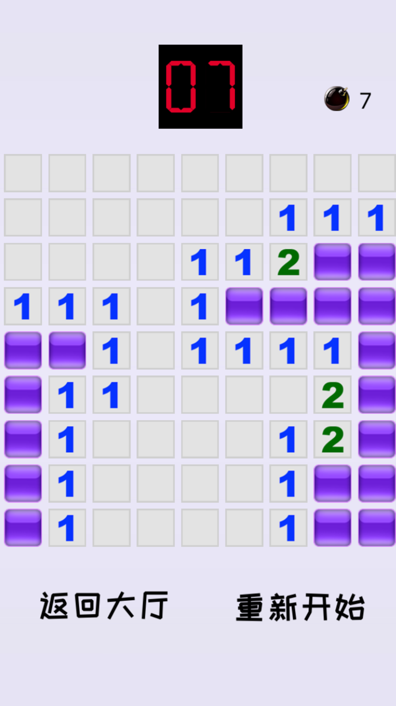

# 血色连环雷


```

The bloody chain of thunder is a strategic game.

Game rules:

The goal of the game is to find all the mines in the minefield as soon as possible, but you can't step on the them. If you step on the mine, the game is over.

The number N appears on the open floor, indicating that there are N mines in the eight grids around the ground. Through the analysis of multiple numbers, the location where the mine exists is inferred. If you don't step on the mine, you can win and enter the next level.

Game features:

With multiple difficulty, the game is getting more and more exciting. 

```




Call us: **7312857438**
